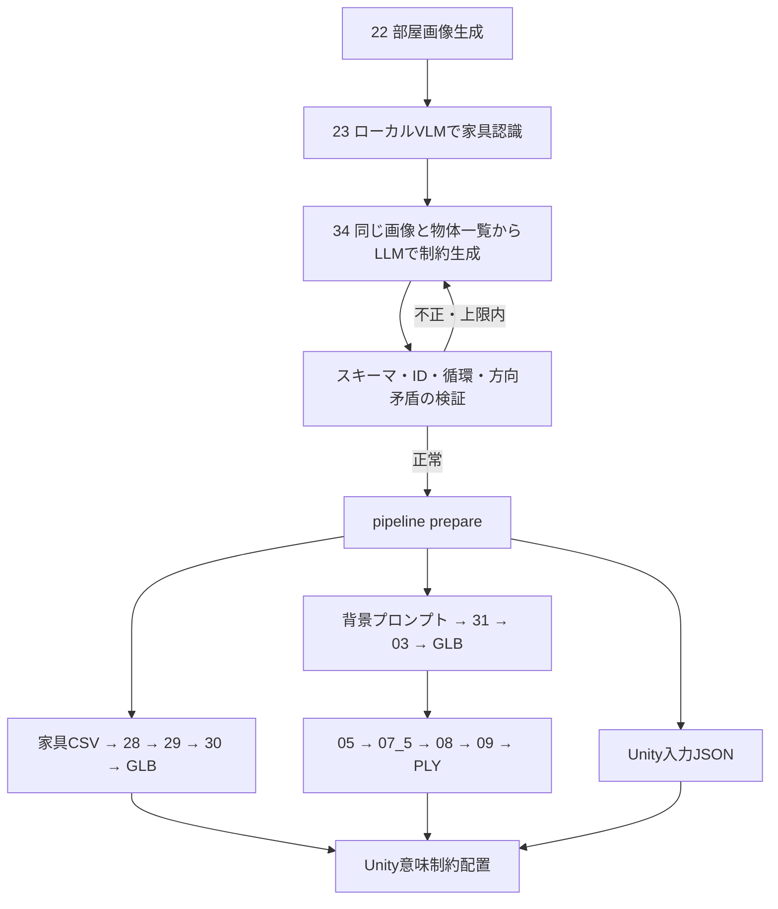

# 動作原理



## モデルが判断する部分

23は実画像をbase64でローカルOllamaへ渡し、JSON Schemaに沿った物体一覧を取得します。入力テキストから家具を増やすキーワード処理はありません。物体ごとにID、カテゴリ、見た目、bbox、推定寸法、表現形式、生成用プロンプトと根拠を持ちます。複数脚の椅子を1つのカテゴリにまとめず、インスタンスとして保持します。

34は認識結果と同じ画像を入力し、関係・重み・根拠・不確かさを返します。画像のSHA256を確認して、別画像の家具一覧を誤って使うことを防ぎます。on、near、face to、左右前後、壁際、部屋中心、窓背景の整列・平行・被覆・可視性はモデルが必要性を判断します。

23の初回認識後には、画像と候補一覧を同じローカルモデルに渡すレビューを1回行います。画像全体・端・隅を見て漏れや重複を見直す工程です。初回・レビュー・修復の出力はそれぞれ監査できます。ただし同じモデルの再確認なので、誤認識を必ず解消する保証はありません。

両工程とも構造・意味検証に失敗すると、検証エラーと直前の出力をモデルへ返します。修復回数は設定値（既定1、最大2）です。上限後は停止し、監査JSONに失敗を残します。ルールで正解を捏造するフォールバックはありません。

認識座標には限定的な正規化を行います。画像端から2%以内の超過のみクリップし、元bbox・カテゴリ・表現形式・可動性が完全一致する別IDを統合します。家具を追加・推測する処理ではありません。raw_resultとcorrectionsを監査ログへ保存し、大きな異常や曖昧な重複は拒否します。

## コードに残す検証と構造

数値の範囲、IDの一意性、対応する関係、支持循環、欠落物体、3D衝突・部屋の境界は計算で検証します。これらは生成する内容を決めるカテゴリルールではありません。

矩形部屋の床・天井・左右壁・背面壁は設定寸法の参照構造です。画像から検出した物体とは区別して保存します。家具の寸法は推定値であり、単眼画像から実寸・カメラ姿勢・隠れた構造が確定したとは扱いません。最終配置にはUnity内の実Boundsを使います。

信頼度はモデルの自己申告値です。低い値を自動削除する閾値は設けておらず、bbox・根拠・uncertaintiesを見て認識結果を確認します。形式検証の成功だけでは認識の正しさを保証しません。

## 家具の探索とスコア

Unityは部屋ローカルの格子、関係先の周囲、支持面から位置・回転候補を作ります。onの支持親から順に改善し、支持物を動かすと子孫も同時に動きます。既定では共通の初期姿勢から探索し、JSON位置を答え座標にしません。

比較は「物理違反の件数 → 違反量 → 意味スコア」の順です。AABBによる有限探索のため、大域最適や凹形状の厳密衝突判定は保証しません。違反量には距離と体積が含まれ、物理的エネルギーではありません。

```text
excess = max(0, 誤差 - 許容値)
満足度 = 1 / (1 + excess / 半減幅)
score_100 = 100 × Σ(重み × 満足度) / Σ(重み)
coverage_100 = 100 × 評価できた制約数 / 期待制約数
```

欠落物体は満足度0で分母に残します。全意味制約の達成・物理違反なし・欠落なしでsuccessです。スコアだけでは成功になりません。

| 関係 | 判定 |
|---|---|
| on | 高さ差0.03m、支持面からのはみ出し0.05mの範囲 |
| near | AABB間の距離、既定1.25m以内 |
| face to | 水平正面と相手方向の角度、既定10度以内、超過35度で半減 |
| against | 壁法線方向の面間隔、既定0.13m以内 |
| left/right、front/behind | 部屋座標での中心差0.1m以上。手前は-Z |
| side of | X方向の間隔。近さは別のnearが必要 |
| 部屋中心 | 水平中心から既定0.75m以内 |

画像内の左右がそのまま部屋の左右とは限らないため、モデルには曖昧な方向関係を不確かな点として残すよう指示します。

## 背景とGaussian

背景は窓基準で調整します。fitInsideは開口寸法×(1-padding)、coverは×(1+margin)を使い、同時達成できない場合があります。behindは背景の手前面を窓の屋外端より外へ配置します。parallelは投影厚みの近似、visible throughは実カメラ検証待ちです。

05でGLBを多視点描画し、07_5で学習、08で確認、09でPLY化します。checkpointの描画設定を共有しますが、視点依存の可視性マスクはPLYへ焼き込めません。最終的な見た目はUnityで確認します。

## 使用するローカルAPI

[Ollamaの画像入力](https://docs.ollama.com/capabilities/vision)と[構造化出力](https://docs.ollama.com/capabilities/structured-outputs)を利用します。モデルは[Qwen2.5-VL 7B](https://ollama.com/library/qwen2.5vl:7b)です。外部OpenAI APIは使用しません。
