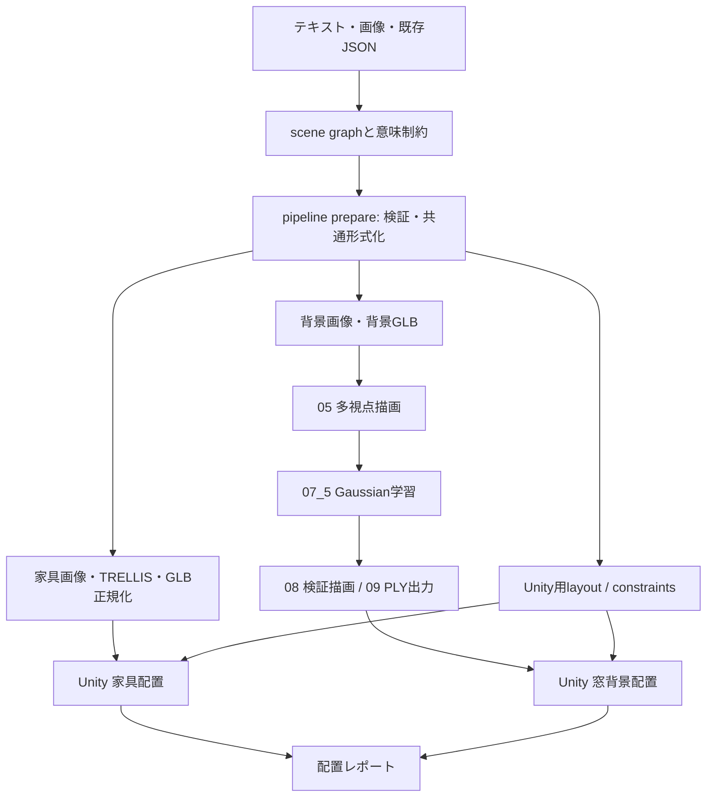

# 動作原理とスコアの説明

## 全体の流れ



生成と配置は別工程です。Pythonはデータ整合・アセット生成の準備と実行を担い、Unityはシーンに存在する物体の寸法を測って配置します。JSONを作っただけでUnity内に家具が自動生成されるわけではありません。

## 共通データ

`pipeline.py`は旧layoutやscene graphをschema_version=2.0へ揃えます。物体ID、表現形式、可動性、座標、アセット参照と意味制約を保持し、同じデータから各ジョブとUnity入力を作ります。

意味制約はsource（配置する物体）、relation（関係）、target（参照先）、weight（重要度）で表現します。例：chair_01がtable_01を向く。重みは座標ではなく、複数の関係を採点する際の比率です。

重複制約は統合し、異なる重みの重複・欠落ID・不正な数値・支持関係の循環などは拒否します。全ての幾何学的矛盾を事前証明する仕組みではありません。

23のscene graph生成はキーワードに基づくルール方式です。画像の内容を認識して構造を推定する機能やLLM呼び出しは実装していません。34の出力も人が確認する初期案です。

## 家具はどのように動くか

`SemanticScenePlacerV2`は有限個の候補を試す探索です。学習済みモデルが配置座標を直接予測する方式ではありません。

1. IDからUnityオブジェクトを対応付け、可動家具と固定参照を分けます。
2. 各物体をroomFrame基準の軸平行境界箱（AABB）で近似します。
3. onの関係から支持する親と載る子を求めます。テーブルと花瓶ならテーブルを先に扱います。
4. 既定のdeterministicStartでは家具を共通の初期姿勢へ戻します。
5. 格子、関係先の周囲、支持面から位置・回転候補を作ります。
6. 一候補を仮適用し、シーン全体の物理状態と意味制約を採点します。支持物を動かすとonの子孫も一緒に動きます。
7. 最良の候補を保持し、家具を順に改善します。最後に全体を再監査します。

既定値はseed=12345、restartCount=1、refinementSweeps=3、candidateLimit=400、candidateStep=0.35mです。候補上限を増やすと試行量が増えますが、必ず成功する保証はありません。

家具のJSON位置を正解として再現する目的関数はありません。意味関係を目標とし、部屋の寸法、実アセットの寸法、床・壁・衝突条件も使います。「意味制約による配置」は物理条件を無視するという意味ではありません。

## スコアの式

各制約について、誤差e、許容値t、許容値を超えてから点数が半分になる誤差幅hを使います。

```text
excess = max(0, e - t)
satisfaction = 1 / (1 + excess / h)
score_100 = 100 × Σ(weight × satisfaction) / Σ(weight)
coverage_100 = 100 × 評価できた制約数 / 期待する制約数
```

許容範囲内ならsatisfaction=1です。許容範囲をhだけ超えると0.5になります。欠落物体や評価不能な制約は満足度0で分母に残します。重みの総和が0ならスコア0です。制約0件の場合は意味制約の完了扱いにしません。

例：同じ重みの2制約について、片方が完全達成、片方が評価不能ならスコア50、カバー率50%です。両方評価できて片方が0.5ならスコア75、カバー率100%です。

### 主な関係の測り方

| 関係 | 現実装の評価 |
|---|---|
| on | 底面と支持物上面の高さ差/0.03と、はみ出し/0.05の大きい方。1以下で達成 |
| near | AABB間の距離。既定1.25m以下 |
| face to | 水平な正面方向と相手への方向の角度。10度以内で達成、超過35度で満足度半分 |
| against | 壁参照のforward方向へ投影した面同士の隙間。既定許容0.13m |
| left/right of | 部屋X方向の中心位置に0.1mの差を要求 |
| in front of / behind | 部屋Z方向の中心位置に0.1mの差を要求。手前は-Z |
| side of | X方向の中心間隔がmax(0.4m,相手の半幅)以上。近さは別のnearで指定 |
| center of room等 | 水平中心からroomCentreまでの距離。既定0.75m以下 |

左右や前後は相手の正面ではなく部屋の座標軸を基準にします。nearも中心間距離ではありません。制約名だけで意味を推測せず、この定義に合わせて入力します。

### 候補を選ぶ優先順位

1. 物理違反の件数が少ない。
2. 件数が同じなら物理違反量が小さい。
3. それも同じなら意味スコアが高い。

物理違反量には境界や支持面からの距離と重複体積が加算されます。単位が混在する探索用の指標であり、物理的なエネルギーではありません。接触・衝突はAABB近似なので凹形状や斜めの家具では厳しすぎる判定があり得ます。

家具レポートのsuccessは物理違反なし・物体欠落なし・期待した全意味制約がokの場合だけです。

## 窓とGaussian背景

`WindowBackgroundPlacerV2`は窓基準で寸法と位置を調整します。通常のRendererで測れない場合は`PlacementBounds`の明示寸法を使います。

- fitInsideの目標寸法：開口寸法×(1-padding)。実装では倍率の下限0.01。
- coverの目標寸法：開口寸法×(1+margin)。
- behind：背景の窓側の面を窓の屋外端より外へ出す。
- 中心合わせなどは対応する明示制約に従って適用する。

fitとcoverには異なる目的があり、縦横比と余白によって両立しません。parallelの判定は投影厚みの近似です。visible throughはカメラ検証が必要な状態として報告します。画像の上下、見切れ、実際の視点からの可視性は描画結果で確認します。

## Gaussianができるまで

05はGLBを多視点で描画し、画像・カメラ情報・整列点群を出します。07_5はそれらを使いGaussianパラメータを最適化しcheckpointに保存します。08はcheckpointから描画し、09はPLYへ変換します。

V2では学習時のrender_settingsを08と09が継承します。明示CLI引数は上書きとして扱います。alphaとprojectionの重みは対応する損失項に適用します。09は有効なスケール範囲をPLYに反映します。

視点依存のZ-buffer可視性マスクはPLYに焼き込めません。学習器の表示とUnity表示が完全に同じとは限らないため、Unityで最終確認します。03の背景板を入力した場合は画像の平面表現であり、本物の3D奥行きが復元されたわけではありません。

## ファイルの役割

| ファイル | 担当 |
|---|---|
| pipeline.py | 共通化・検証・ジョブ作成・Gaussian実行 |
| scripts/render_settings.py | checkpoint設定の継承と検証 |
| SemanticScenePlacerV2.cs | 家具の候補探索・評価・レポート |
| WindowBackgroundPlacerV2.cs | 明示的な窓参照による背景配置 |
| PlacementBounds.cs | 実寸Bounds取得・明示Bounds |
| PlacementMath.cs | スコアと寸法・候補比較の数式 |
| PlacementData.cs | JSON・レポートのデータ型 |
| SceneObjectIdV2.cs | IDとモデル正面の対応付け |
| ReferenceRoomBuilderV2.cs | 固定構造の補助生成 |

元スクリプトの番号別説明と実行コマンドは[README](../README.md)を参照してください。
